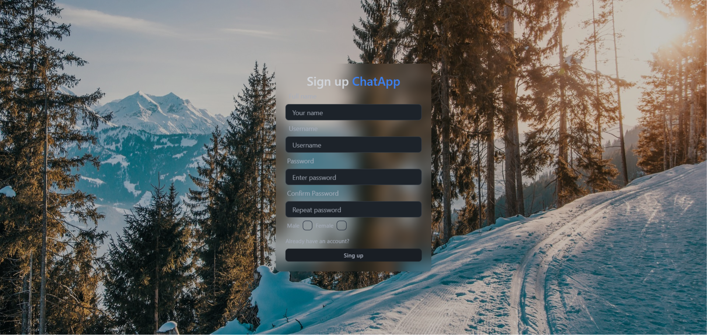
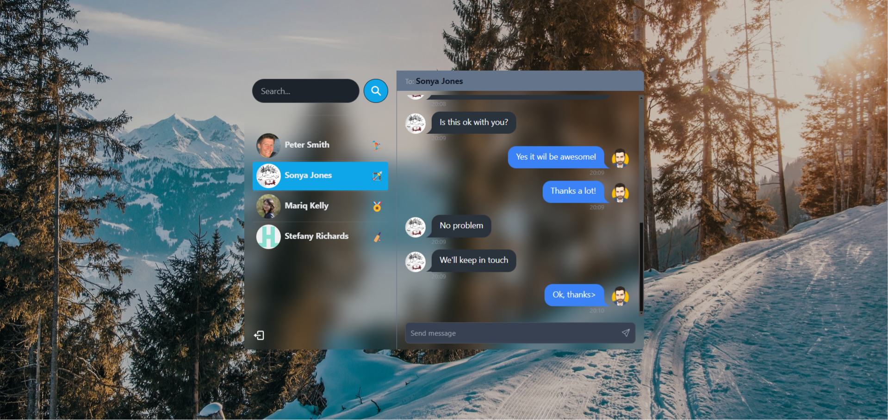
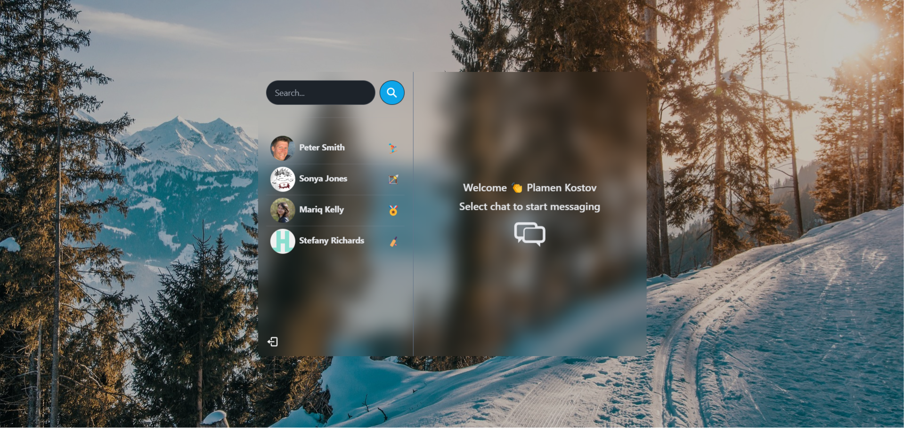

# ChatApp

ChatApp is a web application built using Express.js, React.js, and MongoDB. It is a basic chat app where logged-in users can send and receive messages. The core idea of the project is to expand my knowledge and use of React and MongoDB, and to learn how to use Tailwind, DaisyUI, and Socket.io.

The project is deployed at:
https://chatappproject-fjq6.onrender.com/login

# Login Page

# SignUp Page

# Home Page

## Features

- **Browse chat**: Search among the chats.
- **View online status**: Check the status of the users.
- **Receive audio sound if a message is received in an open conversation**: Get a sound notification with an incoming message.
- **Responsive Design**: The application is responsive and works well on both desktop and mobile devices.

## Installation

1. **Install Dependencies:
npm install

2. ** Running the Project
    From the root folder type:
npm run server
    In the frontend folder type:
npm run dev
    

